# SUNGGEET Workspace: User Guide

A step-by-step guide to the SUNGGEET app: where to tap, what each screen means, and how to do every job in it.

**Open the app:** <https://sungeet-attendance.vercel.app>

The app is built for phones first, and every screen also works on a laptop. The screenshots below are from a phone unless they say otherwise.

---

## Contents

1. [Before you start](#1-before-you-start)
2. [Signing in](#2-signing-in)
3. [Finding your way around](#3-finding-your-way-around)
4. [For singers](#4-for-singers)
5. [For managers](#5-for-managers)
6. [For admins](#6-for-admins)
   - [Home: your daily dashboard](#61-home-your-daily-dashboard)
   - [Shows: create, edit, approve, delete](#62-shows)
   - [Venues: saved cafés and venues](#63-venues)
   - [Copy a whole month](#64-copy-a-whole-month)
   - [Team: add and remove people](#65-team)
   - [Reports: numbers, pay and comparisons](#66-reports)
   - [Website: what the public site shows](#67-website)
7. [Daily check-in (everyone)](#7-daily-check-in-everyone)
8. [Who can see what](#8-who-can-see-what)
9. [Questions and fixes](#9-questions-and-fixes)

---

## 1. Before you start

**Who uses the app**

| Role | What they do |
|---|---|
| **Singer** | Marks the shows they performed at, and says each day whether they're available. |
| **Manager** | Approves or rejects attendance for the shows they manage. |
| **Admin** | Runs everything: shows, venues, people, pay, reports, and the public website. |
| **Superior** | Same as admin, except they can't delete shows or remove people. |

**Put it on your home screen (recommended).** It then opens like a normal app.

- **iPhone (Safari):** open the link, tap the **Share** button, then **Add to Home Screen**.
- **Android (Chrome):** open the link, tap **⋮** (top right), then **Add to Home screen**.

---

## 2. Signing in

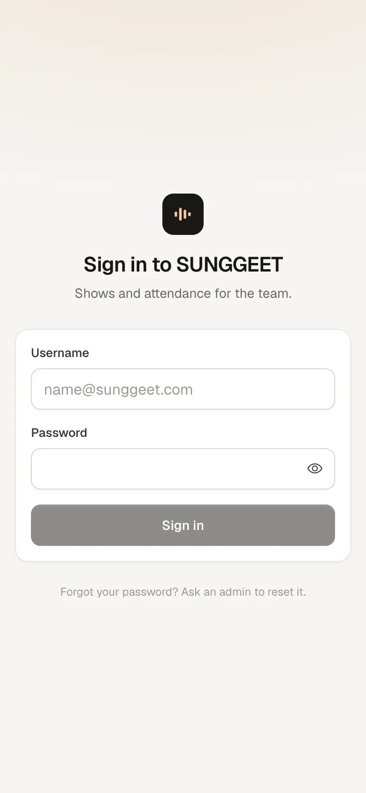

1. Open <https://sungeet-attendance.vercel.app>.
2. **Username:** the one your admin gave you (it looks like an email, e.g. `name@sunggeet.com`).
3. **Password:** tap the **eye** icon to check what you typed.
4. Tap **Sign in**.

You stay signed in on that phone for 12 hours. After that the app takes you back to this screen.

> **Forgot your password?** Ask an admin. There is no self-service reset.

---

## 3. Finding your way around

  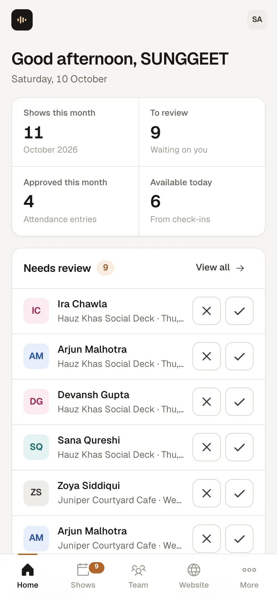
  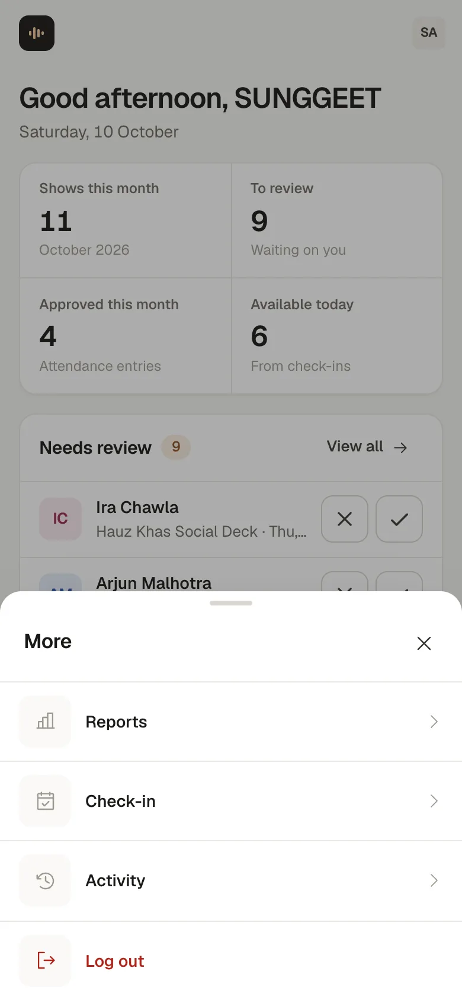
  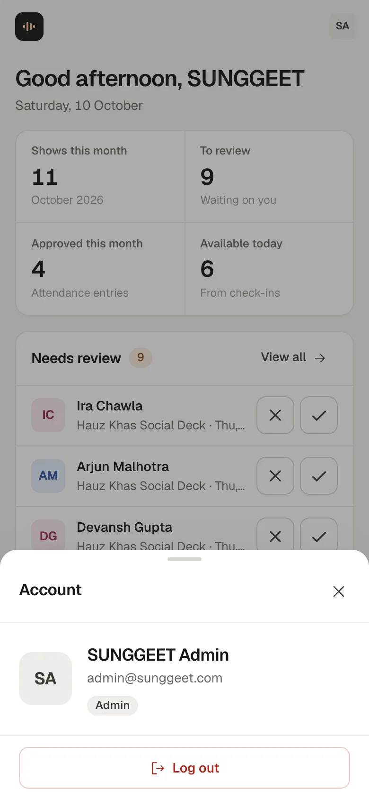

- **Bottom bar:** your main screens. The **Shows** tab shows a small number when something needs doing (shows to approve, or shows to mark).
- **More** (admins only): Reports, Check-in, Activity and **Log out**.
- **Your initials** (top right): your account details and **Log out**.
- **Panels slide up from the bottom.** Tapping a show, a person or a venue opens its details. Close it with **✕** or by tapping the dimmed area.
- **Messages:** after you save something, a short message appears at the bottom, e.g. "Show updated". Errors appear in red.

On a laptop, the bottom bar becomes a menu on the left and panels open from the right:

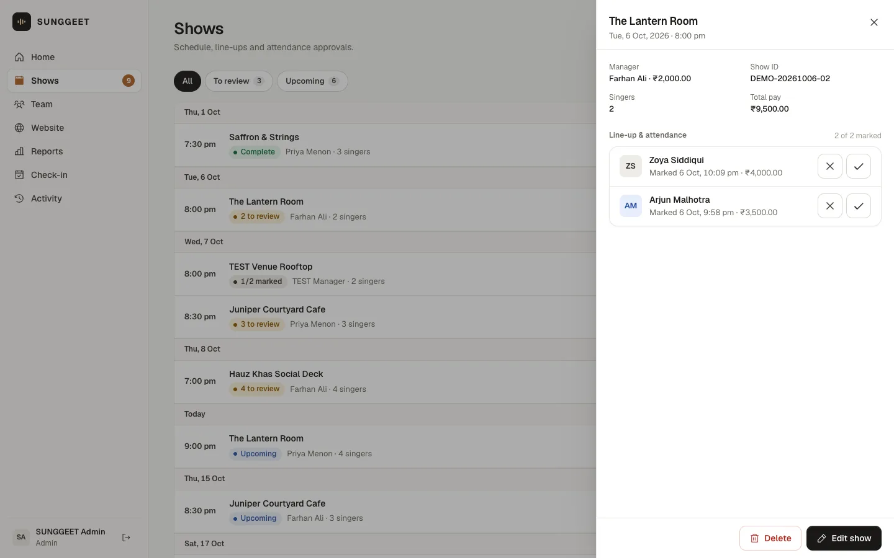

---

## 4. For singers

Your bottom bar: **Home · Shows · Check-in · History**.

### 4.1 Home

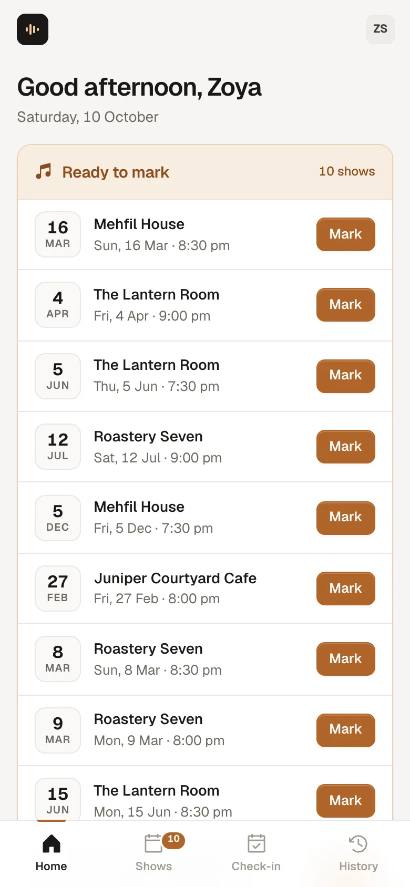

- **Ready to mark** (orange card, top): shows that have **started** that you haven't marked yet.
- **Shows this month / Approved this month / Awaiting approval / Upcoming:** your counts at a glance.
- **Coming up:** your next shows.
- **Are you available today?** See [Daily check-in](#7-daily-check-in-everyone).

### 4.2 Mark your attendance (after a show)

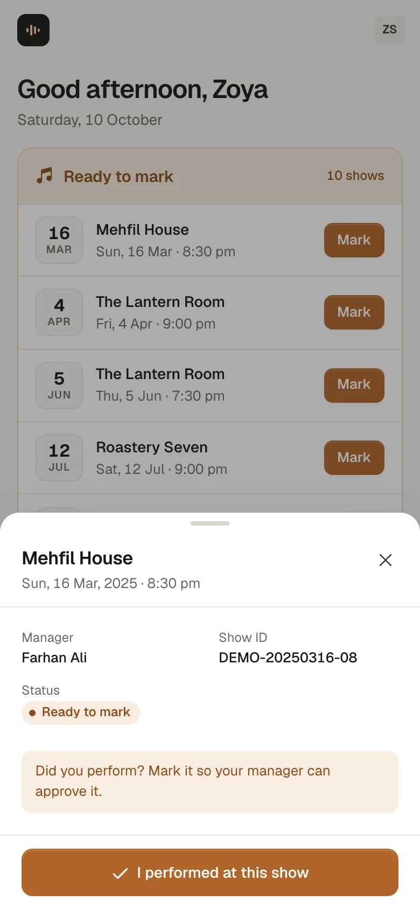

1. On **Home**, find the show under **Ready to mark** and tap **Mark**. You can also open it from **Shows**.
2. Check the venue, date and time at the top.
3. Tap **I performed at this show**.
4. A message confirms it. The show now says **Awaiting approval** until your manager decides.

**Good to know**

- You can only mark a show **after its start time** (India time). Before that, the show says *Upcoming*.
- You can mark each show **once**. If you marked the wrong one, ask your manager to reject it.

### 4.3 Your shows

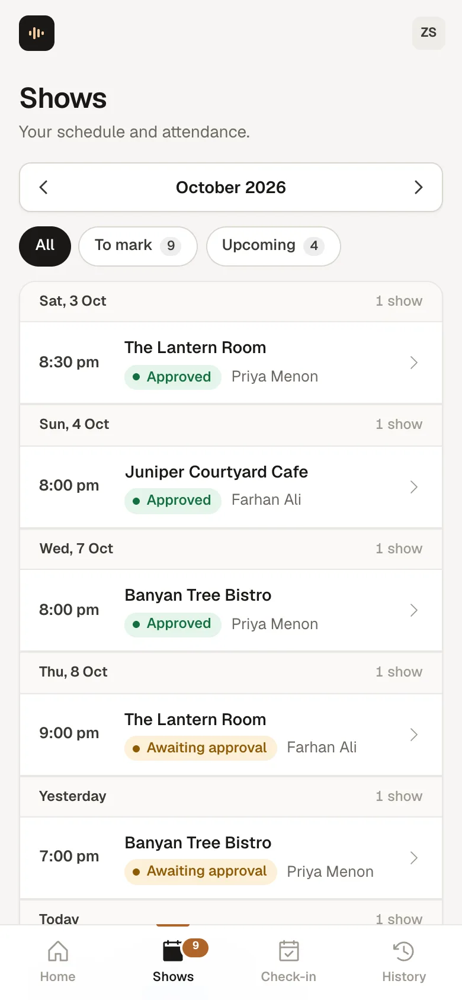

- Use the **‹ month ›** arrows to move between months.
- **Filters:** **All**, **To mark** (anything you haven't marked yet, from any month) and **Upcoming**.
- **Status labels:** *Upcoming*, *Ready to mark*, *Awaiting approval*, *Approved*, *Rejected*.
- Tap a show for its details.

### 4.4 History

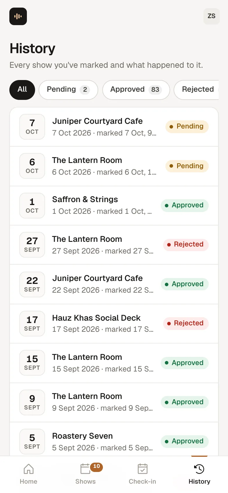

Every show you've marked, newest first, with its decision. Filter by **Pending**, **Approved** or **Rejected**.

---

## 5. For managers

Your bottom bar: **Home · Shows · Check-in · Activity**. You see the shows **you manage**.

### 5.1 Home: approve straight from the list

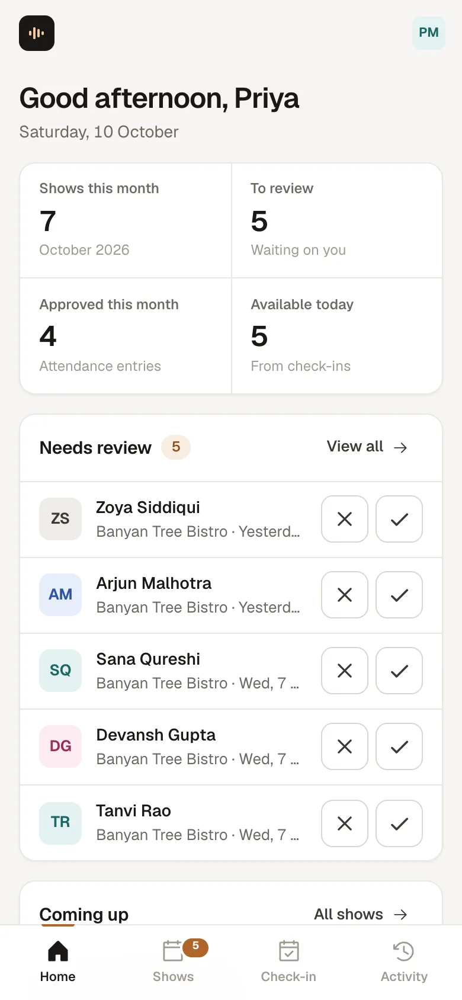

- **Needs review** lists every singer who marked attendance and is waiting on you.
- On each row, tap **✓** to **approve** or **✕** to **reject**. Tap the name to open the show first.
- When the list is empty, it says *You're all caught up*.

### 5.2 Shows

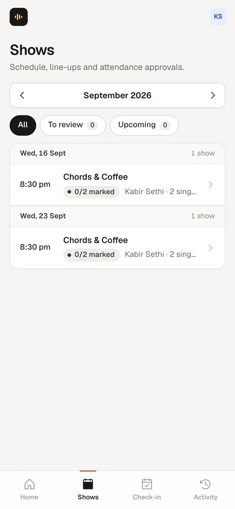

1. Tap **Shows**. Use the **To review** filter to see everything waiting, across all months.
2. Tap a show to open it. Under **Line-up & attendance**, each singer shows one of:
   - **✓ / ✕ buttons:** they marked it and it needs your decision.
   - **Approved / Rejected:** already decided.
   - **Not marked:** the show started but they haven't marked it.
   - **Upcoming:** the show hasn't started.

> Only an **admin** can change a decision after it's made.

---

## 6. For admins

Your bottom bar: **Home · Shows · Team · Website · More** (More holds Reports, Check-in and Activity).

### 6.1 Home: your daily dashboard

- **Shows this month / To review / Approved this month / Available today.**
- **Needs review:** approve **✓** or reject **✕** right here.
- **Coming up:** the next shows. Tap one to open it.

### 6.2 Shows

  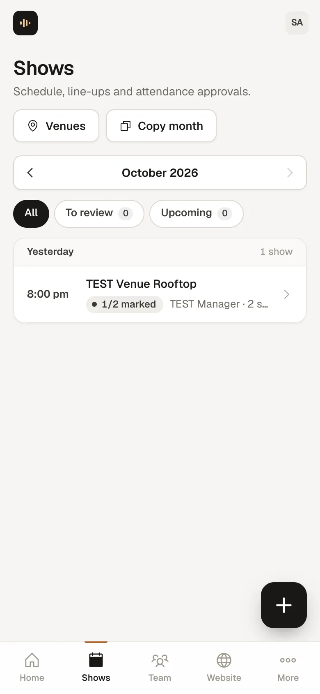
  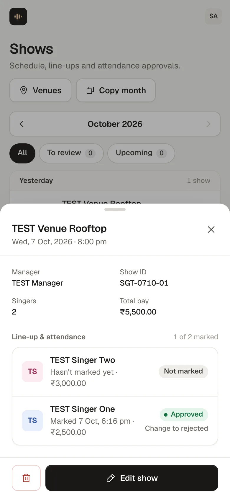

The list is grouped by day (*Today*, *Tomorrow*, *Yesterday*, then dates). Each show displays its time, venue, manager, number of singers and a status:

| Status | Meaning |
|---|---|
| **Upcoming** | Hasn't started yet. |
| **2 to review** | Two singers marked it; approve or reject them. |
| **1/2 marked** | One of two singers has marked it so far. |
| **Complete** | Every singer is approved. |

#### Create a show

  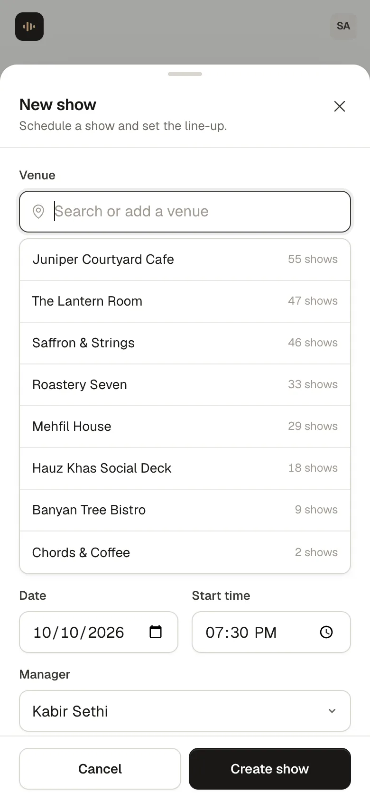
  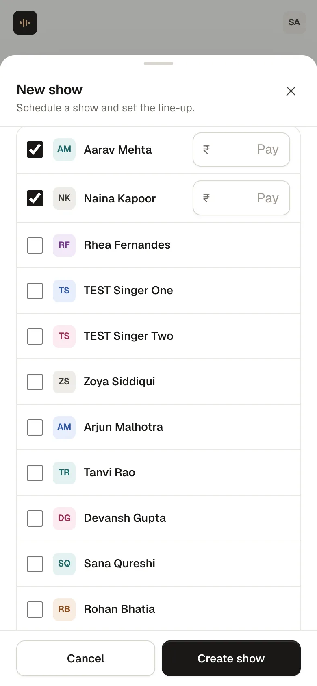

1. Go to **Shows** and tap the black **+** button (bottom right). On a laptop, click **New show**.
2. **Venue:** tap the box to see your saved venues (most-used first). Tap one, or type a few letters to filter. A **green tick** means you picked a saved venue.
   - If the venue isn't saved yet, type its full name. It's saved automatically when you create the show.
3. **Date** and **Start time:** today at 7:30 pm is filled in for you. Change them as needed.
4. **Manager & pay:** pick who runs the show. You have to choose; nothing is pre-selected. In the **₹ Pay** box next to it, enter the manager's pay for this show. It counts as due once the show has started, because managers don't mark attendance.
5. **Singers & pay:** tick each singer. A **₹ Pay** box appears next to each one you tick. Enter what they earn for this show. The singers' total shows under the heading, and **Total incl. manager** shows top right.
6. Tap **Create show**.

#### Edit a show

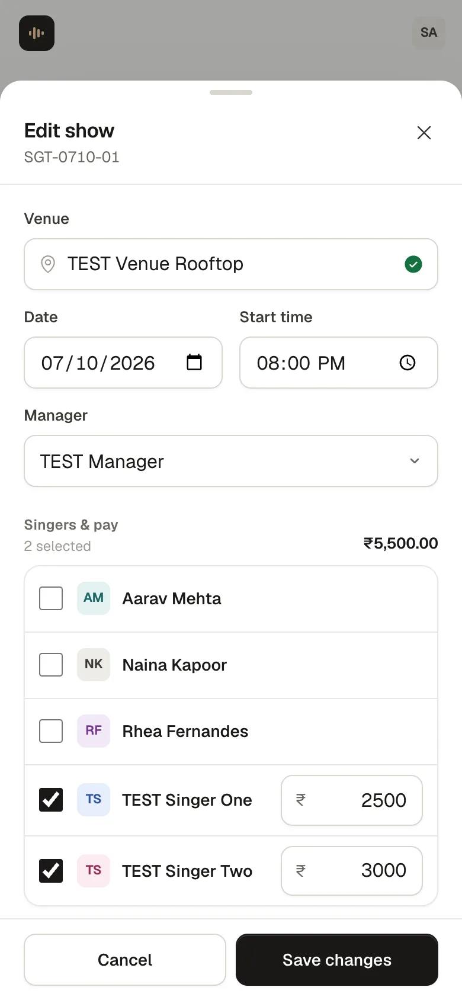

1. Open the show and tap **Edit show**.
2. Change anything (venue, date, time, manager, singers, pay) and tap **Save changes**.

#### Approve, reject, or change a decision

Open the show. Under **Line-up & attendance**:

- Tap **✓** to approve or **✕** to reject anyone who's waiting.
- Under an existing decision, tap **Change to rejected** or **Change to approved** to flip it. Only admins can do this.

#### Delete a show

Open the show and tap **Delete** (red, bottom left), then confirm. This also removes its attendance records and **can't be undone**.

### 6.3 Venues

  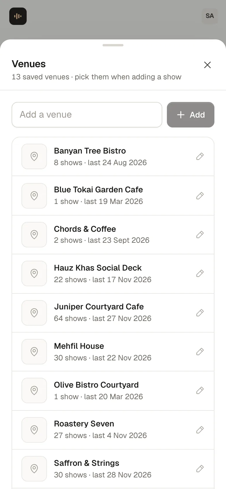
  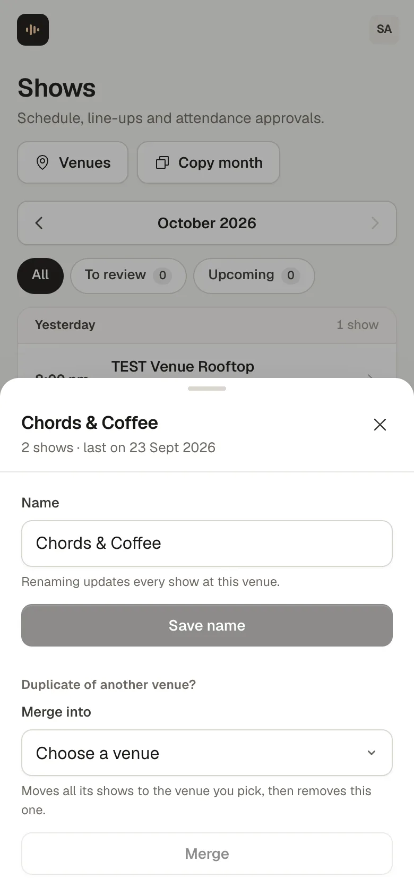

Every café and venue is saved once, then picked from the list when you create a show.

1. Go to **Shows** and tap **Venues** (top).
2. **Add a venue:** type its name in **Add a venue** and tap **Add**.
3. **Rename:** tap the venue, change **Name** and tap **Save name**. Every show at that venue updates too.
4. **Fix a duplicate** (e.g. "Chords & Coffee" and "Chords and Coffee"):
   1. Tap the wrong one.
   2. Under **Merge into**, pick the right one.
   3. Tap **Merge** and confirm. All its shows move across and the duplicate disappears.
5. **Remove:** this only appears for venues with no shows. Merge a venue that has shows instead.

> Names ignore capitals and extra spaces. Typing "chords & coffee" picks the existing **Chords & Coffee**, not a new venue.

### 6.4 Copy a whole month

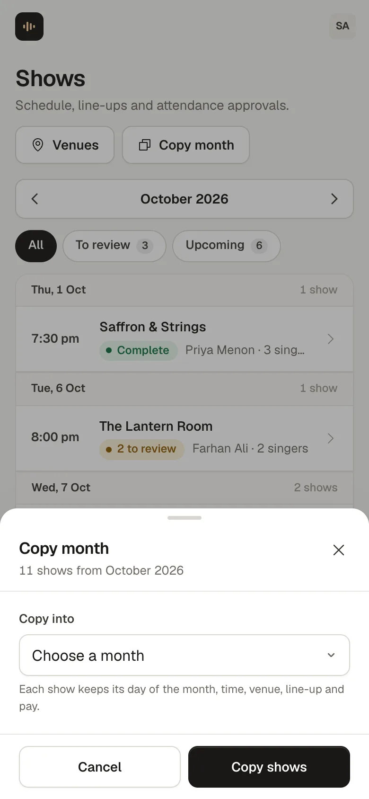

Use this when next month's schedule looks like this month's.

1. Go to **Shows** and use **‹ month ›** to pick the month to copy **from**.
2. Tap **Copy month**.
3. **Copy into:** choose the target month.
4. Tap **Copy shows** and wait for the progress bar.

Each show keeps its day of the month, time, venue, line-up and pay. A show on the 31st goes to the last day of a shorter month. Afterwards, check the new month and edit anything that differs.

### 6.5 Team

  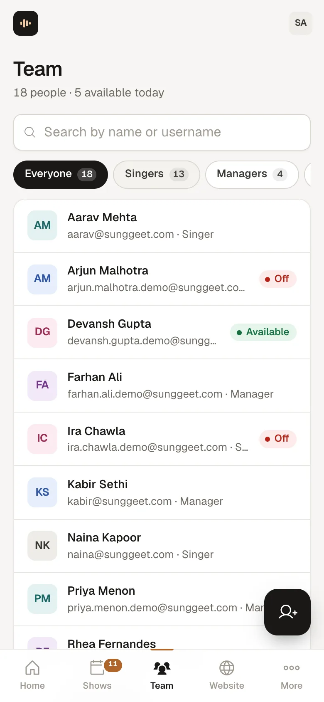
  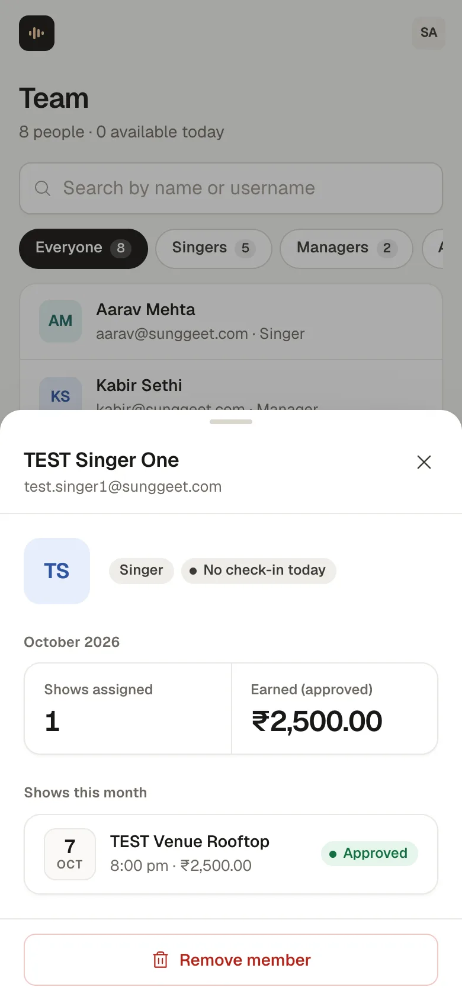
  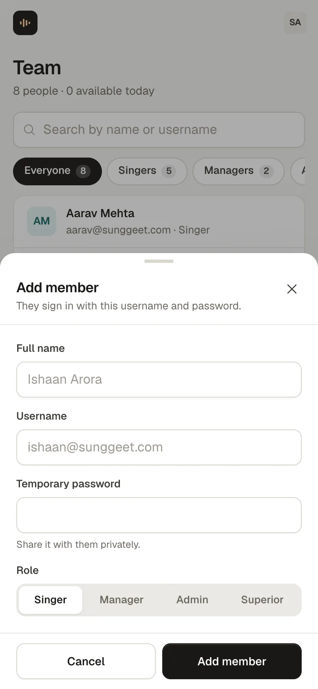

- **Search** by name or username, or filter by **Singers**, **Managers** or **Admins**.
- A green **Available** or red **Off** tag shows that person's check-in for today.
- **Tap a person** to see their shows this month, their earnings (approved shows only) and today's status.

**Add someone**

1. On **Team**, tap the **+ person** button (bottom right). On a laptop, click **Add member**.
2. Enter **Full name**, **Username** (e.g. `ishaan@sunggeet.com`) and a **Temporary password**.
3. Pick a **Role**: Singer, Manager or Admin.
4. Tap **Add member**, then send them their username and password privately.

**Remove someone:** open the person, tap **Remove member** and confirm. Their attendance records are deleted too. You can't remove yourself.

### 6.6 Reports

Open it from **More → Reports** (on a laptop, **Reports** in the left menu). Only admins can see pay.

#### Choose the time span and comparison

  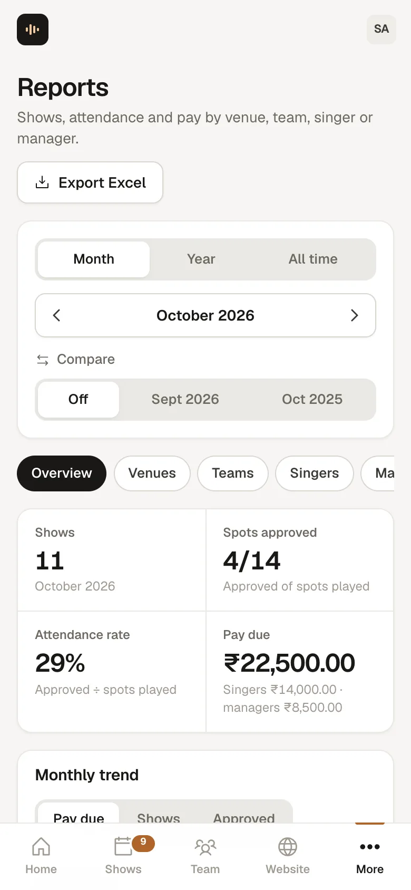
  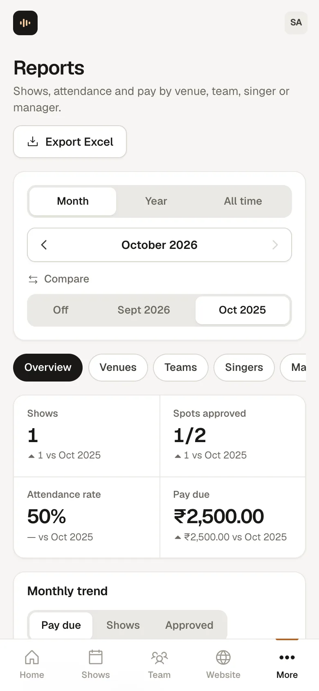
  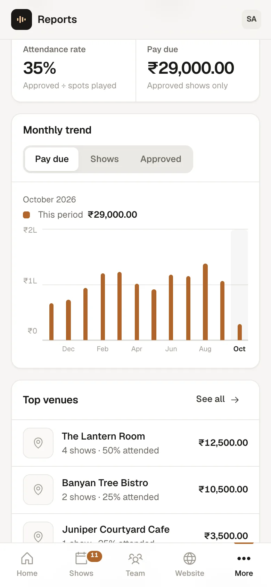

1. **Month · Year · All time:** pick the span, then use **‹ ›** to move between months or years.
2. **Compare:** switch it on to compare with **the previous month**, or with **the same month last year** (when viewing a year, with the previous year). Every number then shows its change, e.g. **▲ ₹2,500.00 vs Oct 2025**.

What each number means:

| Number | Meaning |
|---|---|
| **Shows** | Shows in the period. |
| **Spots approved** | Approved singer slots out of the slots for shows that have started. |
| **Attendance rate** | Approved ÷ slots played. |
| **Pay due** | What to pay out: singer pay for **approved** attendance, plus manager pay for shows that have **started**. The card splits it into singers and managers. |
| **Pay planned** | All pay set on the shows, approved or not. Shown in each item's detail panel. |

**Which pay each view counts:** **Venues** and **Teams** count everything owed for their shows (singers and manager). **Singers** count only that singer's pay. **Managers** count only that manager's own pay.

**Monthly trend:** a 12-month chart. Switch between **Pay due**, **Shows** and **Approved**. Tap a month to see its exact numbers. With Compare on, **brass** bars are the period you picked and **blue** bars are the same months a year earlier:

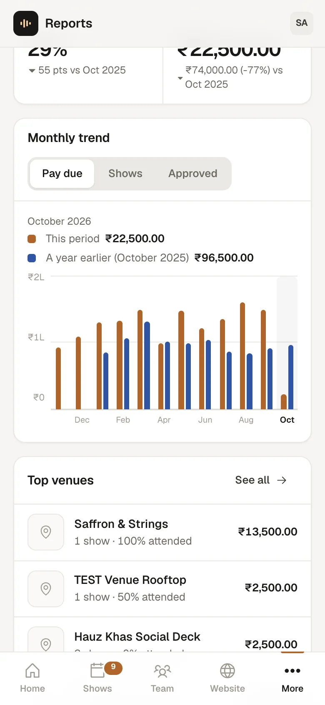

On a laptop, the overview with **Compare → Oct 2025** switched on looks like this:

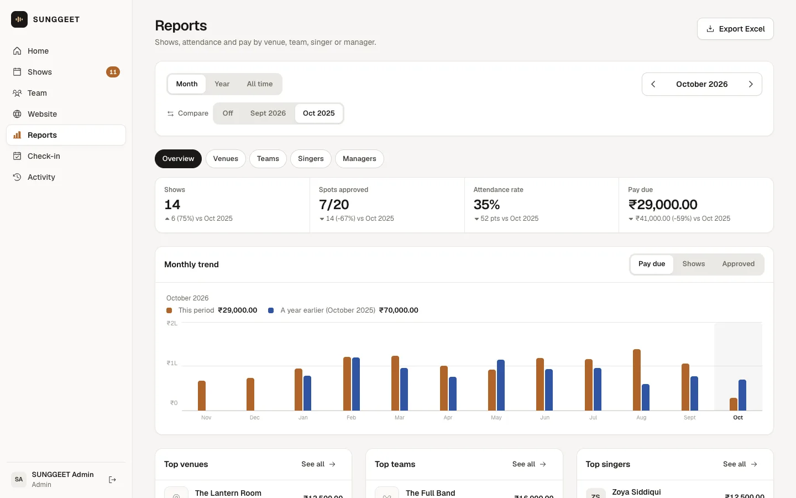

> **Tip:** the current month is still in progress, so it looks low next to a full month a year ago. To compare complete months, step back with **‹** (e.g. **Sept 2026 vs Sept 2025**).

#### Look at each venue, team, singer or manager

  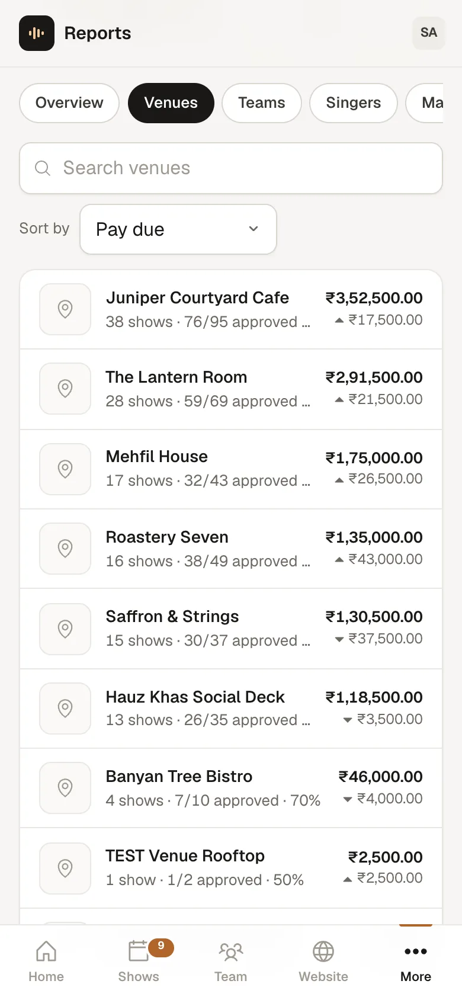
  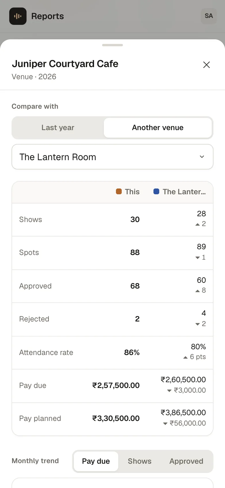
  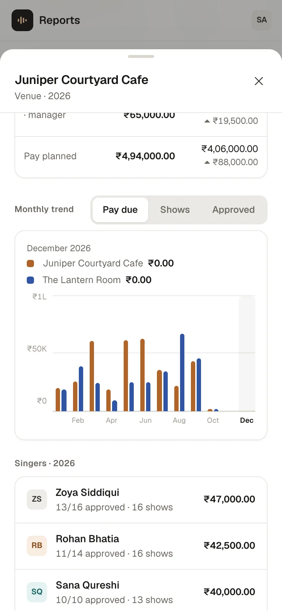

1. Tap a view: **Overview**, **Venues**, **Teams**, **Singers** or **Managers**.
2. The list gives each one's shows, approved slots, attendance rate and pay due, plus a **Total** row. Use **Search** and **Sort by** to find what you need.
3. **Tap any row** to open its own report:
   - Under **Compare with**, pick **Previous month**, **Last year**, or **Another venue / singer / …**, then choose which one. The table shows both side by side with the change.
   - Its own **12-month chart**.
   - **Who played there** (for a venue, team or manager) or **where they played** (for a singer).
   - **Every show** in the period.

In the comparison table, the small **▲ / ▼** number under the second column is how much higher or lower **this** one is. For example, **▼ 9** next to Shows means this venue had 9 fewer shows than the one you compared it with.

**Worked examples**

| Question | Taps |
|---|---|
| Is this year better than last year? | **Year** → **Compare: 2025** → read the four numbers at the top. |
| Which café pays out the most? | **Year** → **Venues** → **Sort by: Pay due**. |
| Juniper Courtyard vs The Lantern Room? | **Venues** → tap **Juniper Courtyard Cafe** → **Another venue** → pick **The Lantern Room**. |
| How did one singer do vs last year? | **Singers** → tap the singer → **Last year**. |
| Which team plays most? | **Teams** → **Sort by: Shows**. |

  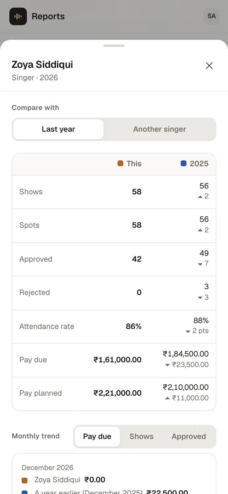
  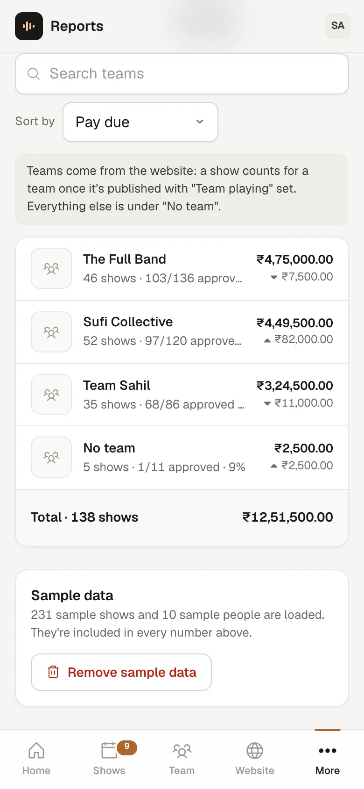

> **Teams** are taken from the website: a show counts for a team once it's published with **Team playing** set ([6.7](#67-website)). Shows without one appear under **No team**.

On a laptop, the views become full tables:

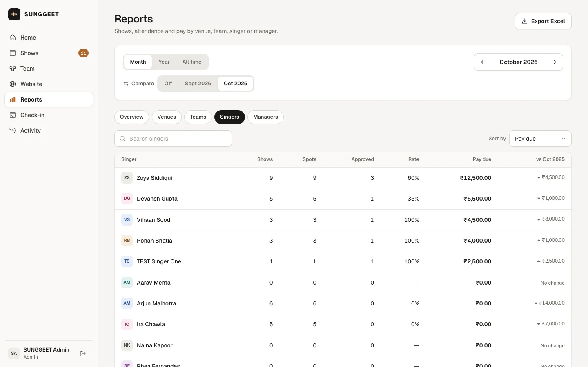

#### Sample data (for demos)

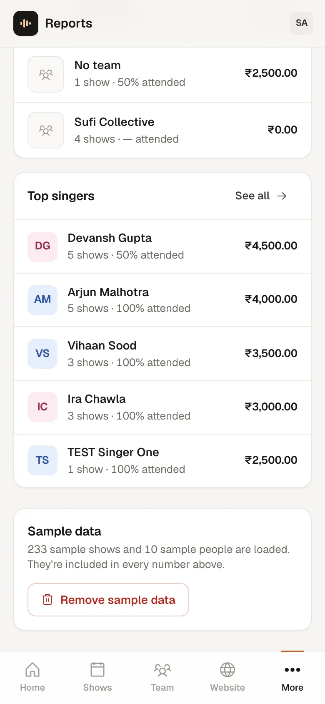

At the bottom of **Reports**, the **Sample data** card loads about two years of realistic sample shows, people, venues and pay, so you can show off Reports and comparisons. It also publishes the upcoming sample gigs on the public website.

- **Load sample data** adds it. Sample people end in `.demo@sunggeet.com` and can't sign in.
- **Remove sample data** deletes all of it, including the website listings. Your real shows, people and pay are never touched.

> Sample pay is counted in every Reports number while it's loaded. **Remove it before using Reports for real payroll.**

#### Export to Excel

On **Reports**, tap **Export Excel**. You get a spreadsheet of every show, singer, attendance decision and pay, ready for payroll.

### 6.7 Website

This controls the public SUNGGEET website. **Changes go live immediately.**

#### Calendar: publish a show

  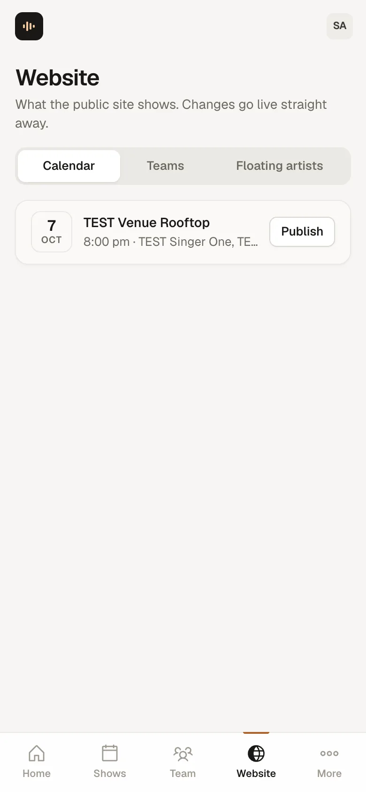
  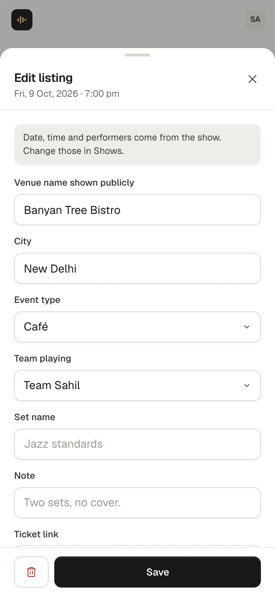

1. Go to **Website → Calendar**. Upcoming shows are listed. **Live** means the show is on the site, **Hidden** means its details are saved but not shown, and a **Publish** button means it isn't on the site yet.
2. Tap a show and fill in:
   - **Venue name shown publicly**, **City** (required) and **Event type**
   - **Team playing:** also used by Reports → Teams
   - **Set name**, **Note** and **Ticket link** (all optional)
   - **Poster:** tap **Choose image** and pick a photo from your phone. It's resized for you (3MB limit).
   - **Visible on the website:** turn it off to hide the show but keep its details.
3. Tap **Save**.

On the public site, published gigs light up on the calendar. Visitors tap a day to see the venue, time, set and the team playing:

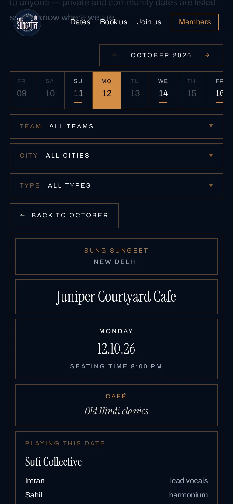

The date, time and performers come from the show itself. Change those in **Shows**, not here. **Remove** (bottom left) takes the show off the website but keeps the show.

#### Teams

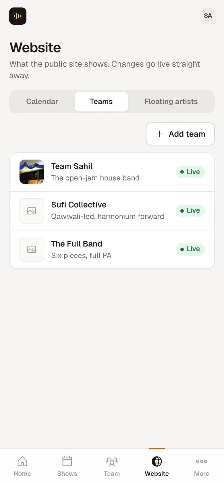

1. Go to **Website → Teams**. Tap a team to edit it, or **Add team** to create one.
2. Set the **Name**, **Tagline**, **Blurb**, **Team photo** and **Showreel link**.
3. **Show this team on the website** turns the team card on or off.
4. Tap **Save**.

#### Floating artists

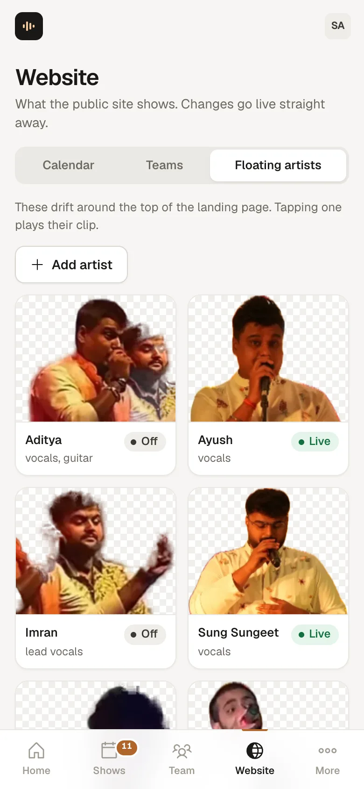

These are the artist cut-outs that drift around the top of the public site and play a clip when someone taps them.

1. Go to **Website → Floating artists** and tap an artist, or tap **Add artist**.
2. Fill in:
   - **Name** and **Plays** (e.g. "vocals, guitar").
   - **Cut-out:** a photo of the artist. A transparent background looks best.
   - **Clip:** a 10–15 second MP3 or M4A, up to 3MB.
   - **Order:** lower numbers show first.
   - **Show on the landing page:** turn the artist on or off.
3. Tap **Save**. **Remove** takes them off the site.

---

## 7. Daily check-in (everyone)

  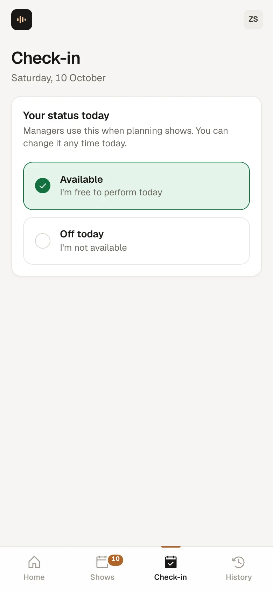
  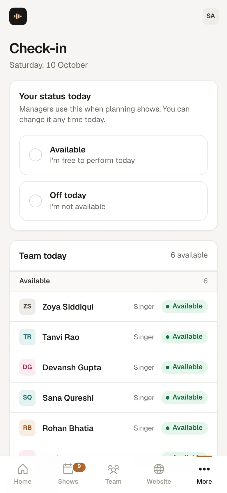

Say each day whether you're free, so managers can plan.

1. On **Home** (under *Are you available today?*) or on **Check-in**, tap **Available** or **Off today**.
2. You can change it any time that day. It resets the next day (India time).

Managers and admins also see **Team today**: who's available, who's off, and (for admins) who hasn't answered yet.

---

## 8. Who can see what

| | Singer | Manager | Admin / Superior |
|---|:-:|:-:|:-:|
| Own shows, mark attendance | ✅ | | |
| Approve or reject attendance | | ✅ (own shows) | ✅ (all shows) |
| Change a decision already made | | | ✅ |
| Create, edit, delete or copy shows | | | ✅ (delete: admin only) |
| Venues | | | ✅ |
| Team (add or remove people) | | | ✅ (remove: admin only) |
| **Pay amounts** | ❌ | ❌ | ✅ |
| Reports and Excel export | | | ✅ |
| Website | | | ✅ |
| Daily check-in | ✅ | ✅ (+ team view) | ✅ (+ team view) |

Pay is admin-only everywhere: managers and singers never receive pay figures, not even behind the scenes.

---

## 9. Questions and fixes

**I can't mark my show.**
It hasn't started yet (India time), or you've already marked it. Check its status in **Shows**.

**I marked the wrong show.**
Ask your manager to reject it.

**A show is missing.**
Check the month with **‹ ›** on **Shows**. Singers and managers only see shows they're assigned to.

**The app shows old information.**
It shows what it loaded last time, then refreshes in the background within a second or two. If it still looks wrong, close the app and open it again.

**I was sent back to the sign-in screen.**
Your 12-hour session ended. Sign in again.

**The same venue appears twice in Reports.**
Merge the two in **Shows → Venues** ([6.3](#63-venues)).

**A team is missing from Reports → Teams.**
Publish its shows on the website with **Team playing** set ([6.7](#67-website)).

**An upload failed.**
Files must be under 3MB. Photos are shrunk for you. For audio, trim the clip or export it as MP3.

**On a shared phone**, tap **Log out** when you're done. It also clears the saved copy of your data from that phone.
